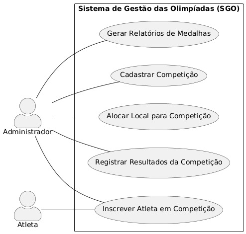
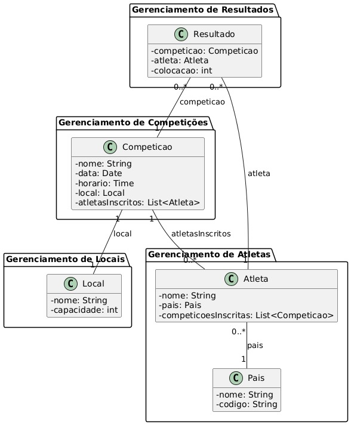
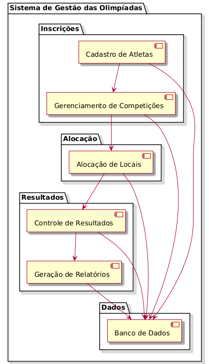
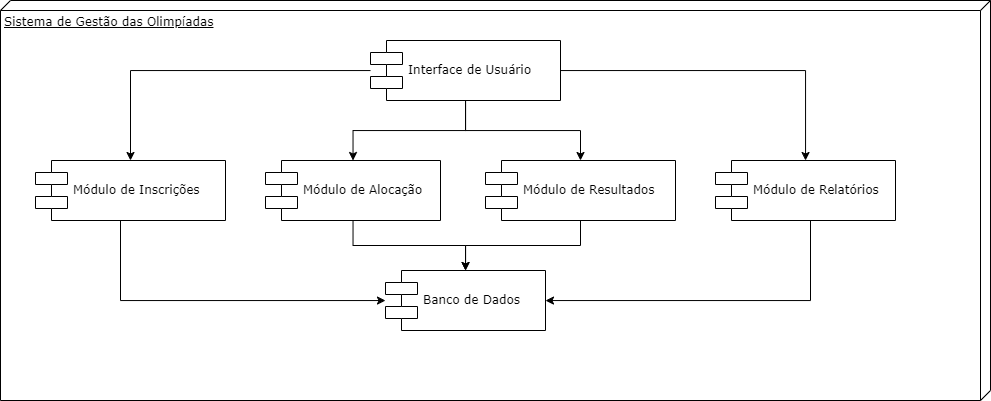
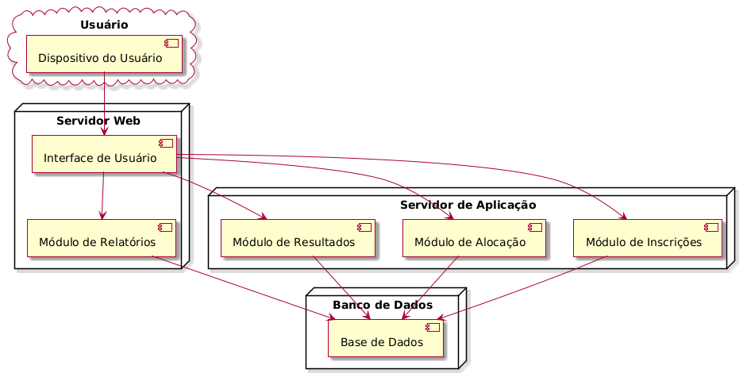

# sistema-gestao-olimpiadas

Davi José Ferreira  
Henrique Lobo

## Contexto

O Sistema de Gestão das Olimpíadas (SGO) é um sistema desenvolvido para coordenar os diferentes aspectos do evento esportivo. Este sistema permite o gerenciamento de competições, inscrições de atletas, alocação de locais para as provas, controle de resultados e geração de relatórios de medalhas, facilitando a organização das Olimpíadas.

## Histórias de Usuário

### US01 - Cadastro de Competições
**Como** um administrador do sistema,  
**eu quero** cadastrar novas competições com informações detalhadas como nome da modalidade, data, horário, local, e lista de atletas inscritos,  
**para que** eu possa gerenciar todas as competições das Olimpíadas com precisão e sem conflitos.

### US02 - Inscrição de Atletas
**Como** um atleta,  
**eu quero** me inscrever em competições específicas dentro das Olimpíadas,  
**para que** eu possa participar das modalidades escolhidas e representar o meu país.

### US03 - Restrição de Países nas Inscrições
**Como** um administrador do sistema,  
**eu quero** garantir que cada atleta possa representar apenas um país por modalidade,  
**para que** não ocorram conflitos e que cada atleta esteja corretamente vinculado ao seu país durante a competição.

### US04 - Alocação de Locais para Competições
**Como** um administrador do sistema,  
**eu quero** alocar locais para cada competição,  
**para que** eu possa garantir que não haja conflitos de horário e que cada competição tenha um local disponível no momento necessário.

### US05 - Controle de Resultados
**Como** um administrador do sistema,  
**eu quero** registrar os resultados das competições, incluindo o atleta vencedor e os classificados em segundo e terceiro lugares,  
**para que** os resultados possam ser armazenados e consultados posteriormente para gerar relatórios de medalhas.

### US06 - Relatórios de Medalhas
**Como** um administrador do sistema,  
**eu quero** gerar relatórios de medalhas por país,  
**para que** eu possa ver o desempenho de cada país com base nas medalhas de ouro, prata e bronze conquistadas nas competições.

## Diagramas

### Diagrama de Caso de Uso

### Diagrama de Classes

### Diagrama de Pacotes

### Diagrama de Componentes

### Diagrama de Implantação

